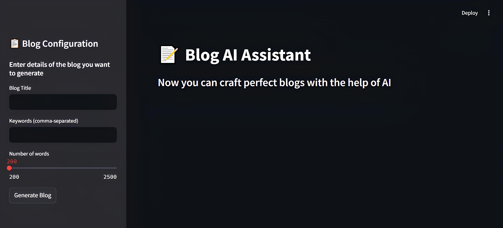

# 📝 AI Blog Assistant

**AI Blog Assistant** is a Streamlit-powered web application that leverages Google's **Gemini 2.0 Flash** LLM to help you generate high-quality blog posts with ease. Simply enter your blog title, keywords, and desired word count — and let AI craft a compelling, well-structured article for you.



---

## Features

* Generate blog content based on a given title, keywords, and word count
* Produces professional, engaging, and readable articles
* Uses Google's **Gemini 2.0 Flash** model for fast and intelligent content generation
* Download blog posts as Markdown files
* Easy-to-use sidebar input form
* Streamlit-powered interface

---

## Project Structure

```
ai-blog-assistant/
│
├── api_key.py             # Contains your Google Gemini API key
├── app.py                 # Main Streamlit app
├── requirements.txt       # Python dependencies
├── images/
│    └── Streamlit_app.jpg
└── README.md              # Project documentation
```

---

## Setup

### 1. Clone the Repository

```bash
git clone https://github.com/MoustafaMohamed01/ai-blog-assistant.git
cd ai-blog-assistant
```

### 2. Install Dependencies

```bash
pip install -r requirements.txt
```
You can install them manually with:

```bash
pip install streamlit google-generativeai st-copy-to-clipboard
```

### 3. Set Up API Key

Create a file named `api_key.py` in the project root:

```python
GEMINI_API_KEY = "your_google_gemini_api_key"
```

Replace `"your_google_gemini_api_key"` with your actual key from [Google AI Studio](https://makersuite.google.com/).

---

## Run the App

```bash
streamlit run app.py
```

The app will open in your default browser at `http://localhost:8501`.

---

## Example Usage

1. Enter your blog title (e.g., *"The Future of AI in Education"*)
2. Add relevant keywords (e.g., *"AI, education, technology, online learning"*)
3. Choose a word count
4. Click **Generate Blog**
5. Copy or download your generated content!

---

## Dependencies

* `streamlit`
* `google-generativeai`

You can install them manually with:

```bash
pip install streamlit google-generativeai st-copy-to-clipboard
```

---

## Author

**Moustafa Mohamed**
[LinkedIn](https://www.linkedin.com/in/moustafamohamed01/) • [GitHub](https://github.com/MoustafaMohamed01) • [Kaggle](https://www.kaggle.com/moustafamohamed01)
